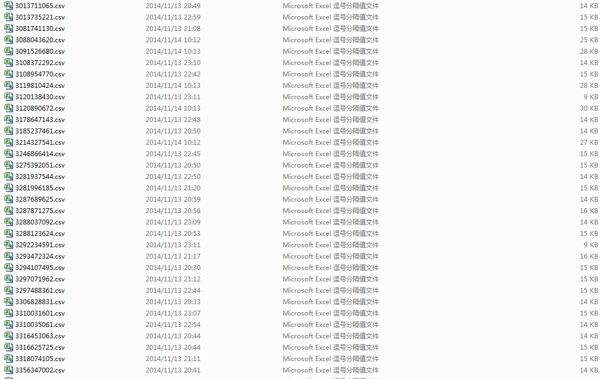
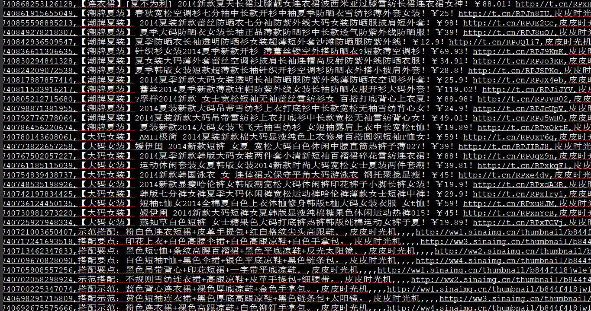
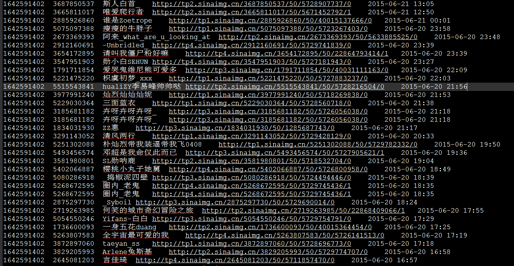

sina_weibo_crawler
========

基于urlib2及beautifulSoup实现的微博爬虫系统。

数据库采用mongodb，原始关系以txt文件存储，原始内容以csv形式存储，后期直接插入mongodb数据库

功能:

	* weibo登陆，原始登陆机制采用模拟登陆，直接用PIL库调出验证码后，人工输入后，将相关参数编码到urllib2中，产生请求，后期采用cookie登陆,
	免去了一系列麻烦。	
	* 爬取推送内容，推送内容主要包括用户发送的数据，包括发送时间、发送来源、转发来源。
	* 爬取用户资料 ，包括用户的性别、年龄、住址、图像、昵称、ID.
	* 爬取用户关注、粉丝名单,由于新浪限制，目前只可以爬取大约5页左右的关注及粉丝列表。
	* 爬取某条消息的评论及转发数据，可以通过解析js数据，爬取任意转发用户、评论用户的评论内容。
	* 采用多进程在多核服务器上并行爬取
DEMO:

架构环境：

	1.python2.7

	2.urllib2+beautifulsoup

	3.multiprocess多进程
	
	4.mongodb

功能框架：

	main.py：后台启动程序

	controller.py：逻辑控制主函数，控制任务个数及多进程数目
	
	mongodb.py：主要是后续的csv数据插入数据库的实现

	craler：这是主要的解析函数
	
	toolit:登陆函数以及下载主函数
	
	uuid.txt:存放初始爬取的种子id

后续工作：
	
	后续需要继续优化的是改成分布式框架，然后解决自动切换cookie功能，目前一个有效cookie一般持续一天。
	